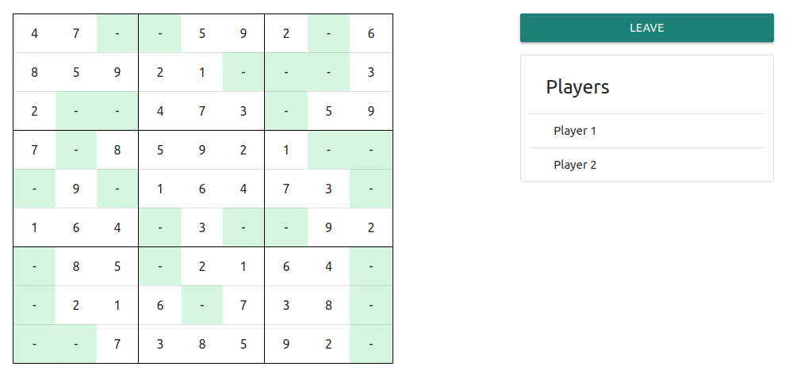
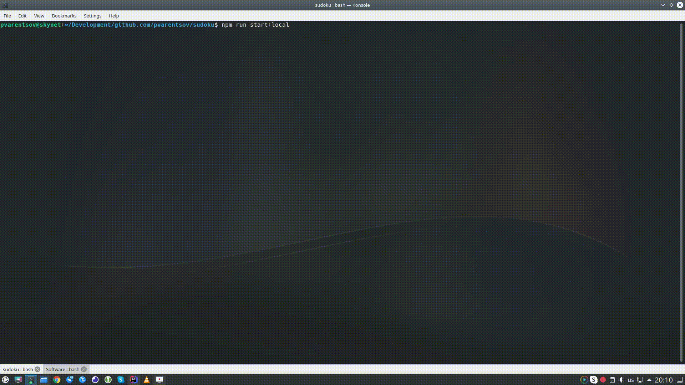

# Sudoku

A Concurrent Sudoku

## How to
1. **Build**
    * Install libs - `npm install`
    * Build app - `npm run build`
2. **Run**  
    * Start app - `npm run start`
    * Expose [local.env](env/local.env) and start app - `npm run start:local`  
3. **Play**  
    * Browse `localhost:[app port]`
    * Chrome is preferred

  

    Screencast
  

     
    

## Ngrok

[Ngrok](https://ngrok.com/) is an easy way to expose local sudoku server to the public internet:

1. Start app - `npm run start`
2. Expose server - `./ngrok http [app port]`
3. Browse generated public url

  

    Screencast
  

     
    

